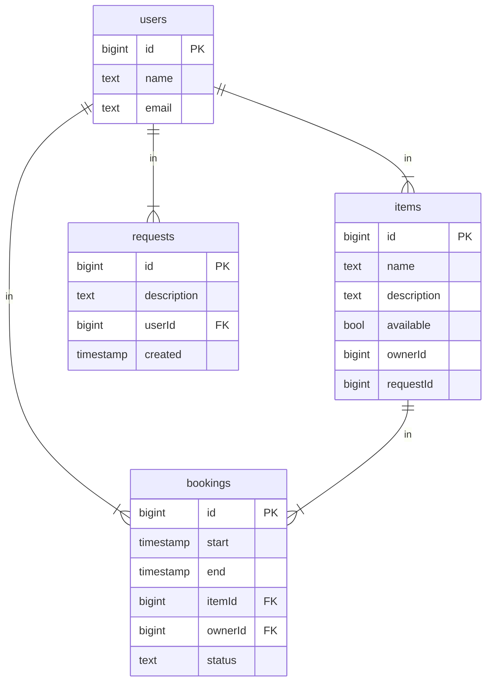

## java-shareit
Template repository for Shareit project.
## ER-diagram

```mermaid
erDiagram
    bookings {
        bigint id PK
        timestamp start
        timestamp end
        bigint itemId FK
        bigint ownerId FK
        text status
    }
    
    items {
        bigint id PK
        text name
        text description
        bool available
        bigint ownerId
        bigint requestId
    }

    users {
        bigint id PK
        text name
        text email
    }

    requests {
        bigint id PK
        text description
        bigint userId FK
        timestamp created
    }

    users || -- |{ bookings: in
    items || -- |{ bookings: in
    users || -- |{ items: in
    users || -- |{ requests: in

```
#

 

